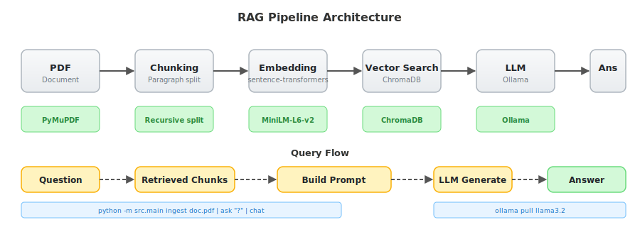

# AI Research Assistant

Local RAG (Retrieval-Augmented Generation) system for querying PDF documents via CLI, REST API, and Web UI.

## Architecture

```
┌──────────────────────────────────────────────────┐
│              Presentation Layer                   │
│   CLI (src/cli/)   API (src/api/)   Web (src/ui/) │
└──────────────────────┬───────────────────────────┘
                       │ calls
┌──────────────────────┴───────────────────────────┐
│               Services Layer (business)           │
│  rag_service  llm_service  pdf_service            │
│  embedding_service                                │
└──────────────────────┬───────────────────────────┘
                       │ orchestrates
┌──────────────────────┴───────────────────────────┐
│            Repositories Layer (data)              │
│  VectorRepository (ChromaDB)                      │
└──────────────────────────────────────────────────┘
```



**Ingestion** — PDF → chunk → embed → store in ChromaDB

**Query** — question → embed → vector search → retrieve chunks → build prompt → LLM → answer

## Setup

```bash
pip install -r requirements.txt
cp .env.example .env   # or: copy .env.example .env
```

### Prerequisites

- **Ollama** running locally with a model pulled
- Python 3.10+

## CLI

```bash
python -m src.cli ingest doc.pdf
python -m src.cli ask "question"
python -m src.cli chat
python -m src.cli status
python -m src.cli remove doc.pdf
python -m src.cli clear
python -m src.cli models
```

## Web UI (React SPA)

```bash
# Production mode (served by FastAPI on :8000)
python -m src.main

# Development mode (HMR on :5173, proxies API to :8000)
cd src/ui && npm run dev
```

### Pages

| Route | Page | Description |
|-------|------|-------------|
| `/` | Documents | Upload, list, and delete PDF documents |
| `/chat` | Chat | Session-based Q&A over your documents |
| `/status` | Status | Vector store stats and model info |

## API

Start the server:

```bash
python -m src.main
# Listening on http://127.0.0.1:8000
# API at http://127.0.0.1:8000/api/*
```

### Endpoints

All endpoints are prefixed with `/api`.

| Method | Endpoint | Description |
|--------|----------|-------------|
| `POST` | `/api/documents` | Ingest a PDF by URL or local path (JSON body) |
| `POST` | `/api/documents/upload` | Ingest a PDF by file upload (multipart) |
| `GET` | `/api/documents` | List ingested documents with chunk counts |
| `DELETE` | `/api/documents` | Clear all documents |
| `DELETE` | `/api/documents/{filename}` | Remove a specific document |
| `POST` | `/api/query` | Ask a question (session-based) |
| `GET` | `/api/status` | Vector store stats |
| `GET` | `/api/models` | Available Ollama models |

### Examples

```bash
# Upload a PDF
curl -X POST -F "file=@paper.pdf" http://127.0.0.1:8000/api/documents/upload

# Ingest from URL
curl -X POST -H "Content-Type: application/json" \
  -d '{"url": "https://example.com/paper.pdf"}' \
  http://127.0.0.1:8000/api/documents

# Ask a question (returns session_id for follow-ups)
curl -X POST -H "Content-Type: application/json" \
  -d '{"question": "What is the main finding?"}' \
  http://127.0.0.1:8000/api/query

# Follow-up in the same conversation
curl -X POST -H "Content-Type: application/json" \
  -d '{"question": "Tell me more", "session_id": "<id from previous>"}' \
  http://127.0.0.1:8000/api/query

# Check store
curl http://127.0.0.1:8000/api/status

# List models
curl http://127.0.0.1:8000/api/models

# Remove a document
curl -X DELETE http://127.0.0.1:8000/api/documents/paper.pdf

# Clear everything
curl -X DELETE http://127.0.0.1:8000/api/documents
```

## Configuration

Edit `.env` to tune:

| Variable | Default | Description |
|----------|---------|-------------|
| `LLM_MODEL` | `llama3.2` | Ollama model name |
| `OLLAMA_BASE_URL` | `http://localhost:11434` | Ollama server URL |
| `EMBEDDING_MODEL` | `all-MiniLM-L6-v2` | sentence-transformers model |
| `CHUNK_SIZE` | `500` | Characters per chunk |
| `CHUNK_OVERLAP` | `50` | Overlap between chunks |
| `TOP_K` | `5` | Retrieved chunks per query |
| `COLLECTION_NAME` | `documents` | ChromaDB collection name |
| `API_HOST` | `127.0.0.1` | API server bind address |
| `API_PORT` | `8000` | API server port |

Model switching is done at runtime — change `LLM_MODEL` in `.env` and restart. The system validates the model exists in Ollama before proceeding.

## Project Structure

```
src/
├── core/            # Config (Pydantic BaseSettings), exceptions
├── models/          # Pydantic domain models (document, conversation)
├── services/        # Business logic
│   ├── rag_service.py
│   ├── llm_service.py     (Ollama HTTP client)
│   ├── embedding_service.py
│   └── pdf_service.py     (PDF loading & chunking)
├── repositories/    # Data access
│   └── vector_store.py    (ChromaDB CRUD)
├── cli/             # CLI presentation (Rich)
│   ├── __main__.py
│   └── app.py
├── api/             # REST presentation (FastAPI)
│   ├── server.py
│   ├── deps.py
│   ├── schemas.py
│   └── routes/
│       ├── documents.py
│       ├── query.py
│       └── status.py
├── ui/              # Web UI (Vite + React + TypeScript)
│   ├── src/
│   │   ├── pages/
│   │   │   ├── documents.tsx
│   │   │   ├── chat.tsx
│   │   │   └── status.tsx
│   │   ├── components/
│   │   ├── hooks/
│   │   └── lib/
│   └── dist/        # Built SPA (served by FastAPI in production)
├── main.py          # Entry point (only `serve`)
data/
└── chroma/          # Vector store persistence (gitignored)
screenshots/
├── architecture.svg
├── status.svg
├── models.svg
├── ingest.svg
├── ask.svg
└── help.svg
```
