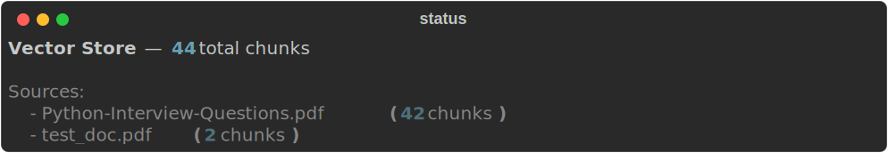
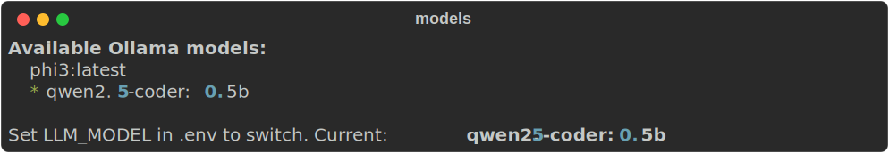
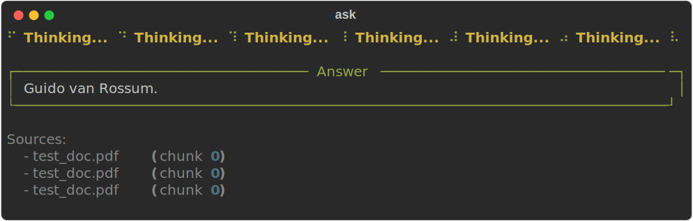
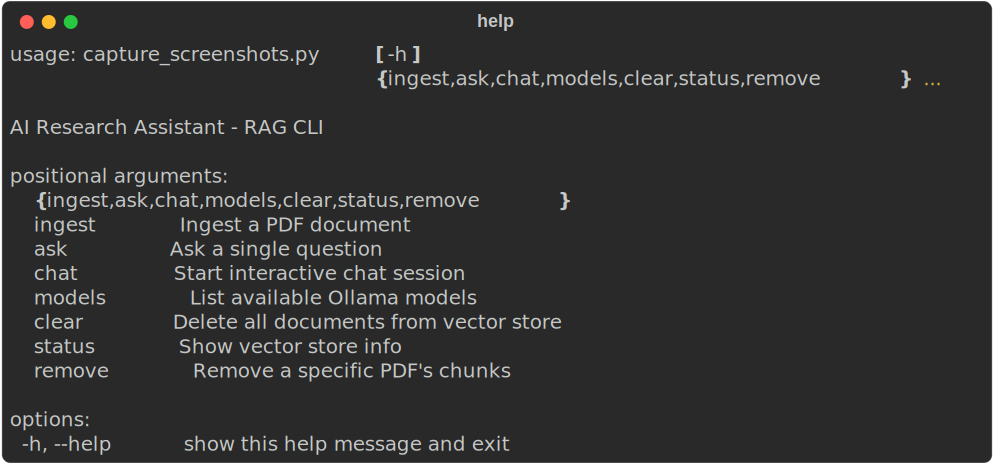

# AI Research Assistant

Local RAG (Retrieval-Augmented Generation) system for querying PDF documents via CLI.

## Architecture


The pipeline works in two stages:

**Ingestion** — PDF → chunk → embed → store in ChromaDB

**Query** — question → embed → vector search → retrieve chunks → build prompt → LLM → answer

## Screenshots

| Command | Preview |
|---------|---------|
| `python -m src.main status` |  |
| `python -m src.main models` |  |
| `python -m src.main ingest doc.pdf` |  |
| `python -m src.main ask "..."` |  |
| `python -m src.main --help` |  |

## Setup

```bash
pip install -r requirements.txt
cp .env.example .env   # or: copy .env.example .env
```

### Prerequisites

- **Ollama** running locally with a model pulled (`ollama pull llama3.2`)
- Python 3.10+

## CLI Commands

| Command | Description |
|---------|-------------|
| `ingest <pdf>` | Load a PDF — extract text, chunk, embed, and store in ChromaDB |
| `ask <question>` | Retrieve relevant chunks and answer via LLM |
| `chat` | Interactive chat session (type `exit` to quit) |
| `status` | Show vector store stats (total chunks, source documents) |
| `remove <pdf>` | Delete all chunks that came from a specific source PDF |
| `clear` | Wipe the entire vector store (asks confirmation) |
| `models` | List installed Ollama models; `*` marks the current one |

### Examples

```bash
# Ingest
python -m src.main ingest paper.pdf

# Ask
python -m src.main ask "What methodology was used?"

# Interactive chat
python -m src.main chat

# Check store
python -m src.main status

# Remove a document's chunks
python -m src.main remove paper.pdf

# Start fresh
python -m src.main clear

# See available LLM models
python -m src.main models
```

## Configuration

Edit `.env` to tune:

| Variable | Default | Description |
|----------|---------|-------------|
| `LLM_MODEL` | `llama3.2` | Ollama model name |
| `OLLAMA_BASE_URL` | `http://localhost:11434` | Ollama server URL |
| `EMBEDDING_MODEL` | `all-MiniLM-L6-v2` | sentence-transformers model |
| `CHUNK_SIZE` | `500` | Characters per chunk |
| `CHUNK_OVERLAP` | `50` | Overlap between chunks |
| `TOP_K` | `5` | Retrieved chunks per query |
| `COLLECTION_NAME` | `documents` | ChromaDB collection name |

Model switching is done at runtime — change `LLM_MODEL` in `.env` and re-run any command. The system validates the model exists in Ollama before proceeding.

## Project Structure

```
src/
├── ingestion/     # PDF loading & text chunking
├── embeddings/    # Vector embedding generation
├── vector_store/  # ChromaDB persistence & search
├── qa/            # LLM client & RAG pipeline orchestration
├── ui/            # Rich CLI interface
├── config.py      # Settings
└── main.py        # Entry point
data/
├── chroma/        # Vector store persistence (gitignored)
screenshots/
├── architecture.svg
├── status.svg
├── models.svg
├── ingest.svg
├── ask.svg
└── help.svg
```
